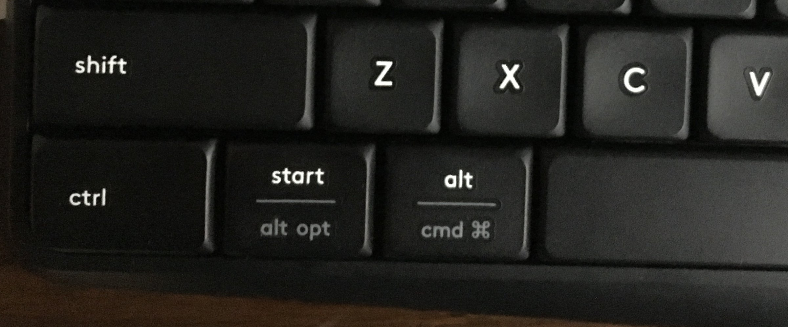

#g80-1800适配K375s说明

###K375s

首先测试K375s键盘，了解快捷键功能

3种连接状态都需测试，F1 F2 F3切换连接

拆解时，K375s垫片下有螺丝，支撑脚下也有螺丝

数据排线需向上掰开接口卡口

###装配说明

1. 先装配 ESC F1 F2 F3和FN键，之后排线和主控连接，用镊子测试整体按键

	FN键为右ALT(右边装配两个按键）
	
	FN键为右Win(右边装配三个按键）
	
	FN+ESC锁定F区按键，用镊子测试F区按键
	
	全部测试通过可以装配所有按键

4. 排线装配时，蓝色面总是朝外，金属面面向PCB板，对主控连排线也一样

5. F1 F2 F3按键的LED是三种连接状态的指示灯，LED正负标识见板子背面

	三种连接状态的指示灯也可装在原键盘灯位，正负标识见板子背面

6. 排线接口，主板接口是向外拉开卡扣，两边同时拉；主控接口是向上掰开接口

7. 排线脆弱，整个过程请注意保护排线

8. 整个键盘有三个按键PrtSc ScrollLock Pause没有作用

9. 注意5号电池盒需要反放，既电池面朝下，电池盒背面朝上

###快捷键说明

FN键为右ALT(右边装配两个按键）或 FN键为右Win(右边装配三个按键）

F1 F2 F3 三个通道切换

FN+ESC 锁定F区按键

F4 F5 F6

F7 F8 F9

F10 F11 F12 音量调整

FN+Insert 抓屏键即PrtSc键

FN+PgUp 计算器键

FN+O 长按 MAC模式

FN+P 长按 WIN模式

 

